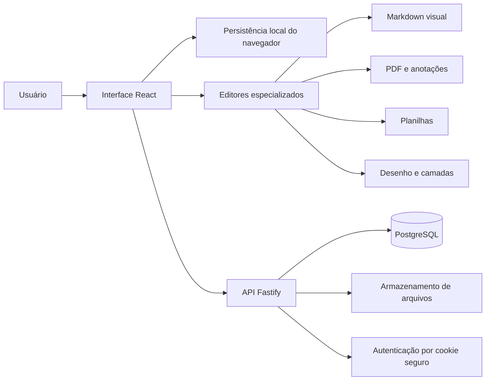

# Orbe — contexto completo do projeto

## 1. O que é o Orbe

O **Orbe** é um sistema de organização pessoal e gestão de conhecimento pensado para funcionar como um **segundo cérebro digital**. A proposta é oferecer um espaço livre no qual cada pessoa possa escrever, desenhar, importar documentos, organizar projetos, guardar referências e relacionar informações sem ficar presa a um único formato de arquivo ou a uma estrutura rígida.

O conceito combina características de ferramentas como:

- **Notion**, pela liberdade de organização, páginas, conteúdo estruturado e experiência web;
- **Obsidian**, pela valorização de Markdown, arquivos do usuário e possibilidade de armazenamento local;
- **Samsung Notes**, pela escrita manual, desenho e uso natural de caneta;
- **Krita e aplicativos de desenho**, pelo uso de ferramentas de traço, borracha, histórico e camadas;
- leitores e anotadores de PDF, pela preservação do documento original e criação de anotações posicionadas em cada página.

O objetivo de longo prazo não é ser apenas um bloco de notas. O Orbe deve se tornar um ambiente pessoal para capturar, editar, guardar, pesquisar e conectar praticamente qualquer tipo de conhecimento.

## 2. Princípios do produto

### Liberdade de formato

O usuário não deve precisar converter todo o seu conteúdo para um formato exclusivo do Orbe. O sistema procura interpretar e editar aquilo que conhece, mantendo o arquivo original preservado sempre que a conversão completa não for segura ou possível.

### Local primeiro, nuvem opcional

O projeto foi pensado para permitir conteúdo local e armazenamento por API. Atualmente há persistência no navegador, armazenamento de arquivos pela API e banco PostgreSQL local. Uma nuvem externa completa, sincronização offline e resolução de conflitos ainda fazem parte da evolução futura.

### Edição não destrutiva

Arquivos importados, especialmente PDFs, não devem ser sobrescritos silenciosamente. As anotações são mantidas como dados separados. Quando necessário, o Orbe gera uma nova cópia anotada e conserva o original.

### Organização pessoal

Cada usuário possui seus próprios documentos, páginas e arquivos. A estrutura foi preparada para páginas hierárquicas, favoritos, documentos recentes e diferentes tipos de conteúdo.

### Interface simples para recursos avançados

Ferramentas como camadas, canetas diferentes, Markdown, arquivos e banco de dados devem existir sem transformar a experiência em uma interface excessivamente técnica.

## 3. Funcionalidades disponíveis atualmente

### Área principal

A interface possui uma área de trabalho com barra lateral, navegação, favoritos, páginas privadas, documentos recentes, busca visual, ações rápidas e acesso aos editores. O visual é responsivo e se adapta a telas menores.

### Importação universal

O fluxo de importação identifica o tipo de arquivo e seleciona o editor mais adequado. O modelo atual reconhece:

- Markdown;
- PDF;
- planilhas Excel;
- pacotes do Samsung Notes;
- arquivos genéricos;
- documentos de desenho criados no próprio Orbe.

Quando o formato não pode ser editado com fidelidade, o original é preservado e o usuário pode adicionar descrição, contexto ou observações.

### Editor Markdown visual

O Markdown deixou de usar a experiência principal dividida entre código e pré-visualização. Agora ele utiliza uma superfície única de edição visual: o texto já aparece formatado enquanto é escrito, em um comportamento próximo do modo de edição ao vivo do Obsidian.

O editor possui:

- títulos;
- negrito e itálico;
- listas com marcadores e listas numeradas;
- citações;
- código inline;
- desfazer e refazer;
- edição do Markdown bruto como ferramenta secundária.

Mesmo usando uma experiência visual, o conteúdo continua sendo serializado como Markdown, evitando aprisionamento em HTML proprietário.

### Leitor e anotador de PDF

O PDF é renderizado internamente, página por página. Cada anotação guarda:

- a página à qual pertence;
- os pontos do traço;
- posição relativa dentro da página;
- cor;
- espessura;
- opacidade;
- tipo de ferramenta.

Essa estrutura corrige o problema da antiga camada global: um desenho feito no início do documento não aparece indevidamente quando o usuário navega para outra página.

O PDF original permanece inalterado. O usuário pode gerar e baixar uma **cópia anotada**, na qual os traços são aplicados às páginas correspondentes.

O editor oferece dois modos:

- **Anotar**, que ativa a superfície de desenho;
- **Navegar**, que permite rolar e consultar o documento sem desenhar.

Também há zoom, desfazer, refazer, borracha, cores, controle de espessura e exportação.

### Ferramentas de desenho

O motor de desenho é compartilhado pelo PDF e pelo quadro livre. Ele trabalha com traços vetoriais representados por sequências de pontos, e não apenas com uma imagem rasterizada.

As ferramentas atuais são:

- lápis;
- caneta;
- marcador;
- marca-texto;
- borracha;
- seletor de cor;
- ajuste de espessura;
- desfazer com `Ctrl + Z`;
- refazer com `Ctrl + Shift + Z`;
- limpeza de conteúdo.

Cada ferramenta utiliza combinações diferentes de largura e opacidade para produzir comportamentos visuais distintos.

### Quadro de desenho livre e camadas

O quadro livre permite desenhar sem um documento de fundo. Ele possui um painel de camadas com:

- criação de camada;
- seleção da camada ativa;
- nome editável;
- mostrar ou ocultar;
- bloquear ou desbloquear;
- alterar a ordem;
- excluir camada;
- opacidade por camada.

Cada traço é associado ao identificador da camada na qual foi criado.

### Planilhas

Arquivos Excel podem ser lidos no navegador e transformados em uma grade editável. O editor permite selecionar células, alterar valores, adicionar linhas e exportar novamente para `.xlsx`.

O editor atual é uma base funcional e não pretende ainda reproduzir todas as funções do Excel, como fórmulas avançadas, gráficos, múltiplas abas e formatação condicional.

### Samsung Notes

Como o formato do Samsung Notes pode conter estruturas proprietárias, a importação é feita de maneira não destrutiva. O Orbe abre o pacote e procura conteúdo textual em arquivos internos como texto, XML, HTML e JSON.

Quando encontra texto recuperável, ele o apresenta para edição. Quando não encontra, conserva o arquivo original e orienta o usuário a usar uma exportação em PDF ou Word para obter maior fidelidade.

### Arquivos genéricos

Arquivos sem editor específico continuam registrados e preservados. O usuário pode adicionar um resumo ou descrição, evitando que o arquivo fique sem contexto dentro do segundo cérebro.

## 4. Persistência e armazenamento

### Navegador

Notas, metadados dos documentos, conteúdo Markdown, células de planilha, anotações e camadas podem ser persistidos localmente no navegador. Objetos `File` e URLs temporárias não são gravados diretamente no `localStorage`, pois não são serializáveis e podem expirar.

### API de arquivos

Quando há uma sessão autenticada, arquivos podem ser enviados à API. A API registra os metadados no PostgreSQL e salva o conteúdo binário no diretório de uploads. O identificador retornado fica associado ao documento, permitindo buscar novamente o arquivo original.

### PostgreSQL local

O banco local se chama `orbe`. A aplicação usa uma conta técnica própria, cuja senha foi gerada aleatoriamente e armazenada no `.env`, que é ignorado pelo Git.

O esquema possui três entidades principais:

#### `users`

Armazena identidade, e-mail, hash da senha, nome de exibição, papel de acesso e data de criação.

Papéis atuais:

- `admin`;
- `user`.

#### `pages`

Armazena páginas do usuário, hierarquia por `parent_id`, título, ícone, conteúdo JSON, favorito e datas de atualização. Há índices para listagem por atualização e busca textual em português.

#### `files`

Armazena proprietário, página relacionada, nome original, nome interno seguro, MIME type, tamanho e data de criação. O arquivo físico não é gravado diretamente dentro do PostgreSQL; apenas os metadados ficam no banco.

### Contas locais preparadas

- `admin@orbe.local`, com nome **Administrador** e papel `admin`;
- `mats@orbe.local`, com nome **Mats** e papel `user`.

As contas receberam inicialmente a senha fornecida pelo proprietário durante a configuração. A senha não deve ser documentada nem enviada ao repositório e deverá futuramente poder ser alterada pela interface.

O papel de administrador já existe no modelo de dados, mas ainda não há um painel administrativo completo nem todas as rotas de gestão global. Portanto, o papel está preparado estruturalmente, mas a administração visual e as políticas avançadas ainda fazem parte do roadmap.

## 5. Arquitetura atual



O projeto está separado principalmente em:

- `app/`: interface web, componentes, editores, estilos e comunicação com a API;
- `server/`: API, autenticação, upload e acesso ao PostgreSQL;
- `public/`: manifesto PWA e arquivos públicos;
- `docker-compose.yml`: ambiente opcional com PostgreSQL e API em contêineres;
- `.env`: configuração local e segredos, sem versionamento;
- `output/`: artefatos gerados, como PDFs de documentação.

## 6. Tecnologias utilizadas

### Linguagem e interface

- **TypeScript**: linguagem principal do front e do back, adicionando tipagem estática e melhor segurança durante o desenvolvimento.
- **React 19**: construção da interface por componentes e gerenciamento da experiência interativa.
- **vinext**: camada de aplicação compatível com a estrutura do Next.js sobre Vite e ecossistema Cloudflare.
- **Vite**: compilação e ambiente de desenvolvimento rápido.
- **Tailwind CSS 4** e CSS próprio: base de estilos, responsividade e identidade visual.
- **Lucide React**: biblioteca de ícones.

### Editores e formatos

- **Tiptap**: editor visual estruturado usado no Markdown.
- **Tiptap Markdown**: leitura e serialização do conteúdo em Markdown.
- **PDF.js (`pdfjs-dist`)**: leitura e renderização das páginas do PDF.
- **pdf-lib**: criação da cópia anotada e aplicação dos traços no PDF exportado.
- **read-excel-file**: leitura de planilhas Excel no navegador.
- **write-excel-file**: exportação de planilhas para `.xlsx`.
- **JSZip**: abertura e inspeção de pacotes compactados, incluindo Samsung Notes.

### API e banco

- **Fastify**: servidor HTTP rápido e modular.
- **PostgreSQL 16 local**: banco principal utilizado na máquina de desenvolvimento.
- **pg**: cliente PostgreSQL para Node.js.
- **Zod**: validação dos dados e das variáveis de ambiente.
- **Argon2id**: hash seguro das senhas de usuários.
- **JOSE/JWT**: emissão e validação dos tokens de sessão.

### Segurança da API

- **@fastify/helmet**: cabeçalhos HTTP de segurança;
- **@fastify/cors**: restrição da origem autorizada;
- **@fastify/rate-limit**: limite de requisições e proteção adicional nas rotas de login e cadastro;
- **@fastify/cookie**: sessões em cookie `HttpOnly`;
- **@fastify/multipart**: upload controlado de arquivos;
- validação de extensão do nome interno;
- nomes físicos de arquivo baseados em UUID;
- limite atual de 100 MB por upload;
- proteção contra origem não autorizada para operações de escrita;
- consultas parametrizadas para evitar SQL injection;
- isolamento de páginas e arquivos pelo proprietário;
- remoção de dados sensíveis dos logs;
- `.env` ignorado pelo Git.

Em produção, cookies seguros dependem de HTTPS e a configuração de TLS do PostgreSQL deve ser ativada quando o banco não estiver na mesma rede privada.

### Infraestrutura

- **Docker Compose**: alternativa para executar PostgreSQL e API de forma reproduzível;
- volumes Docker separados para o banco e para uploads;
- healthcheck do PostgreSQL;
- rede interna entre API e banco;
- exposição da API apenas em `127.0.0.1:4000` na configuração local Docker.

## 7. Autenticação e sessões

O cadastro e o login exigem e-mail válido e senha com no mínimo 12 caracteres. As senhas são transformadas em hashes Argon2id; a senha original não é salva no banco.

Depois do login, a API gera um JWT com validade de sete dias e o coloca em um cookie:

- `HttpOnly`, impedindo acesso direto pelo JavaScript do navegador;
- `SameSite=Strict`, reduzindo riscos de CSRF;
- `Secure` quando o ambiente está em produção;
- escopo global da aplicação.

O front consulta `/auth/me` para recuperar a sessão ativa.

## 8. Endpoints principais da API

### Autenticação

- `POST /auth/register`;
- `POST /auth/login`;
- `GET /auth/me`;
- `POST /auth/logout`.

### Sistema

- `GET /health`.

### Páginas

- `GET /api/pages`;
- `POST /api/pages`;
- `PATCH /api/pages/:id`;
- `DELETE /api/pages/:id`.

### Arquivos

- `GET /api/files`;
- `GET /api/files/:id`;
- `POST /api/files`.

## 9. Aplicação web, desktop e mobile

O Orbe já possui manifesto web com modo `standalone`, tema, nome e categoria. Isso forma a base de uma **Progressive Web App**, permitindo que navegadores compatíveis ofereçam instalação na tela inicial ou no desktop.

Entretanto, é importante distinguir o estado atual da visão final:

- a aplicação web responsiva já existe;
- a base instalável via navegador está preparada;
- empacotamento nativo com Tauri, Electron ou Capacitor ainda não foi implementado;
- cache offline completo, sincronização em segundo plano e integração profunda com sistema de arquivos ainda não estão prontos;
- suporte avançado a pressão e inclinação de caneta ainda pode ser adicionado usando Pointer Events.

## 10. Como executar

### Pré-requisitos

- Node.js 22.13 ou superior;
- npm;
- PostgreSQL local, ou Docker Desktop para o ambiente em contêineres.

### Front-end

```powershell
cd D:\Programacao\orbe
npm run dev:front
```

O front fica disponível em `http://localhost:3000`.

### API

```powershell
cd D:\Programacao\orbe
npm run dev:back
```

A API fica disponível em `http://localhost:4000`.

### Compilação

```powershell
npm run build
npm --prefix server run build
```

### Docker

```powershell
docker compose up --build
```

Esse comando inicia a API e o PostgreSQL definidos no Compose. O front continua podendo ser executado com `npm run dev:front` durante o desenvolvimento.

Somente o banco Docker:

```powershell
docker compose up -d postgres
```

## 11. Estado das validações

No último ciclo de desenvolvimento:

- a compilação do front foi concluída com sucesso;
- a compilação TypeScript da API foi concluída com sucesso;
- os novos componentes passaram na verificação ESLint direcionada;
- a auditoria das dependências de produção não encontrou vulnerabilidades;
- o endpoint de saúde respondeu corretamente;
- a sessão da conta Mats foi validada contra o PostgreSQL local.

O conjunto de testes legado ainda procura arquivos do antigo starter de preview e uma meta tag de desenvolvimento. Esses testes precisam ser reescritos para representar o Orbe atual. O lint completo também contém pendências anteriores em `app/page.tsx`, principalmente regras de efeitos React e acessibilidade.

## 12. Limitações atuais

- não há sincronização offline-first completa entre banco, arquivos locais e nuvem;
- não existe ainda resolução de conflitos entre dispositivos;
- o painel de administrador ainda não foi criado;
- o papel `admin` ainda não representa uma interface global completa;
- o sistema de páginas da API ainda não armazena todos os estados especializados dos editores em tabelas próprias;
- planilhas ainda não possuem fórmulas avançadas, gráficos e múltiplas abas;
- a importação do Samsung Notes depende do conteúdo recuperável do pacote;
- não há OCR para PDFs digitalizados;
- não há pesquisa semântica, backlinks automáticos ou visualização em grafo funcional;
- não há colaboração em tempo real;
- não há versionamento de documentos nem lixeira com recuperação;
- o quadro de desenho ainda não possui seleção e transformação de traços, formas geométricas, texto, laço e suporte avançado à pressão;
- o README original ainda descreve o starter vinext e precisa ser substituído pela documentação do Orbe;
- o aplicativo ainda não foi empacotado como executável nativo.

## 13. Próximas etapas recomendadas

### Curto prazo

1. Persistir anotações, camadas e conteúdo especializado na API, não apenas no navegador.
2. Criar troca de senha e gestão básica da conta.
3. Atualizar o README e substituir os testes do starter.
4. Corrigir as pendências de acessibilidade e efeitos React em `app/page.tsx`.
5. Adicionar seleção, movimentação e transformação de traços.
6. Melhorar borracha por segmento, pressão da caneta e atalhos configuráveis.
7. Criar miniaturas e navegação lateral para páginas do PDF.

### Médio prazo

1. Implementar armazenamento local robusto com IndexedDB e acesso a arquivos locais.
2. Criar sincronização entre armazenamento local e API.
3. Implementar histórico e versões por documento.
4. Adicionar busca global textual e backlinks.
5. Relacionar páginas, arquivos e blocos em um grafo de conhecimento.
6. Criar painel administrativo e políticas reais para o papel `admin`.
7. Adicionar OCR e indexação de PDFs.

### Longo prazo

1. Empacotar o desktop com Tauri.
2. Avaliar Capacitor ou uma PWA avançada para mobile.
3. Implementar colaboração e sincronização em tempo real.
4. Adicionar pesquisa semântica e recursos de inteligência artificial opcionais.
5. Criar extensões, plugins e API pública.
6. Suportar criptografia local ou ponta a ponta para espaços privados.

## 14. Resumo do estágio do produto

O Orbe está no estágio de **protótipo funcional avançado / início de MVP**. A identidade visual, o fluxo de importação, os editores principais, a API segura e o PostgreSQL local já formam uma base concreta. O sistema demonstra a proposta central: receber formatos diferentes e oferecer experiências de edição adequadas sem destruir os originais.

Ainda não é uma substituição completa de Notion, Obsidian, Krita, Excel e Samsung Notes. A força do projeto está justamente em construir uma camada unificadora entre esses tipos de experiência. O próximo salto de maturidade será transformar os editores atualmente funcionais em um sistema consistente de persistência local-first, sincronização, pesquisa e relacionamento entre conhecimentos.

## 15. Definição curta para apresentações

> O Orbe é um segundo cérebro digital local-first que reúne notas visuais, Markdown, PDFs anotáveis, planilhas, desenhos em camadas e arquivos pessoais em um único ambiente. Ele preserva os formatos originais, oferece edição especializada para cada conteúdo e combina armazenamento local com uma API segura em TypeScript e PostgreSQL.
